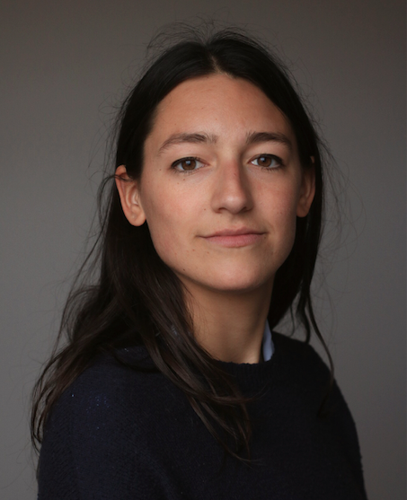

# Welcome to my website!

{ width="220" style="float: right; margin: 0 0 1rem 1rem;" }

I am a PhD candidate at ECARES at the Université libre de Bruxelles, under the supervision of Estelle Cantillon.

My research focuses on energy and environmental economics. I study the design of electricity markets to support the energy transition. I am particularly interested in understanding how policies in the (downstream) retail market can affect price formation and market power in the (upstream) wholesale market. 

I am currently visiting the Toulouse School of Economics (TSE), hosted by Stefan Ambec.

I will be on the Job Market Fall 2026.
